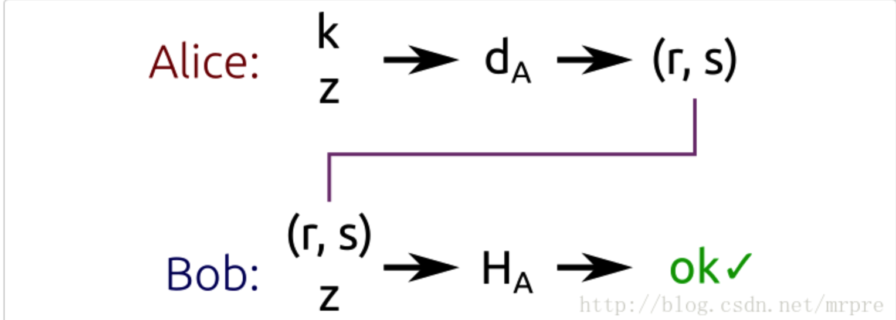
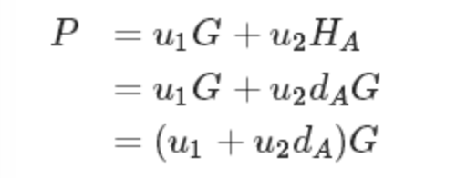
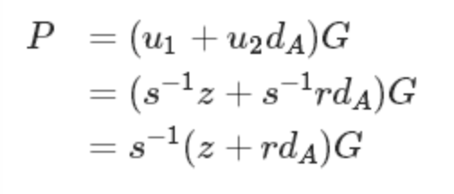

# 以太坊地址生成过程
文章目录
* 1 以太坊地址生成过程
* 2 以太坊地址生成实例
  * 2.1 生成随机数作为私钥
  * 2.2 私钥生成公钥
  * 2.2.1 使用 bx 工具生成公钥
  * 2.2.2 使用 secp256k1-py 包生成公钥
  * 2.3 计算公钥哈希值
  * 2.4 得到地址
* 3 以太坊地址生成 Python3 实现
* 4 参考资料
## 1 以太坊地址生成过程

以太坊地址生成过程如下：

* 生成 256 位随机数作为私钥。
* 将私钥转化为 secp256k1 非压缩格式的公钥，即 512 位的公钥。
* 使用散列算法 Keccak256 计算公钥的哈希值，转化为十六进制字符串。
* 取十六进制字符串的后 40 个字母，开头加上 0x 作为地址。
## 2 以太坊地址生成实例
生成以太坊地址过程实例数据：

* 私钥：1f2b77e3a4b50120692912c94b204540ad44404386b10c615786a7efaa065d20
* 公钥：04dfa13518ff965498743f3a01439dd86bc34ff9969c7a3f0430bbf8865734252953c9884af787b2cadd45f92dff2b81e21cfdf98873e492e5fdc07e9eb67ca74d
* 地址：0xabcd68033A72978C1084E2d44D1Fa06DdC4A2d57
## 2.1 生成随机数作为私钥
生成 256 位随机数：
```
>>> import random
>>> r = random.randint(0, 2**256)
>>> r
14098500174935566811277058424286341448580475958153633347646702637404947635488
>>> r.to_bytes(32, byteorder='big').hex()
'1f2b77e3a4b50120692912c94b204540ad44404386b10c615786a7efaa065d20'
```
## 2.2 私钥生成公钥
以太坊使用的椭圆曲线算法为 secp256k1，从私钥生成对应的公钥有两种方法：比特币工具 bx 和 secp256k1-py 包。
### 2.2.1 使用 bx 工具生成公钥
Mac 用户可以使用 brew 安装 bx 工具：
```
$ brew install bx
```
以 1f2b77e3a4b50120692912c94b204540ad44404386b10c615786a7efaa065d20 作为私钥，然后使用 bx 工具将私钥转化为 secp256k1 的非压缩格式公钥：
```
$ bx ec-to-public 1f2b77e3a4b50120692912c94b204540ad44404386b10c615786a7efaa065d20 -u
04dfa13518ff965498743f3a01439dd86bc34ff9969c7a3f0430bbf8865734252953c9884af787b2cadd45f92dff2b81e21cfdf98873e492e5fdc07e9eb67ca74d
```
### 2.2.2 使用 secp256k1-py 包生成公钥
使用 pip 安装：
```
$ pip install secp256k1
```
之后将私钥转化为公钥：
```
>>> import secp256k1
>>> private_key = '1f2b77e3a4b50120692912c94b204540ad44404386b10c615786a7efaa065d20'
>>> private_key = bytes.fromhex(private_key)
>>> privkey = secp256k1.PrivateKey(private_key)
>>> privkey.pubkey.serialize(compressed=False).hex()
'04dfa13518ff965498743f3a01439dd86bc34ff9969c7a3f0430bbf8865734252953c9884af787b2cadd45f92dff2b81e21cfdf98873e492e5fdc07e9eb67ca74d'
```
## 2.3 计算公钥哈希值
要使用 keccak256 哈希算法，可以使用 PyCryptodome 工具，使用 pip 进行安装：
```
$ pip install pycryptodome
```
公钥开头去除 04，将剩余部分转化为字节串并使用 keccak256 算法进行哈希:
```
>>> from Crypto.Hash import keccak
>>> keccak_hash = keccak.new(digest_bits=256)
>>> public_key = '04dfa13518ff965498743f3a01439dd86bc34ff9969c7a3f0430bbf8865734252953c9884af787b2cadd45f92dff2b81e21cfdf98873e492e5fdc07e9eb67ca74d'[2:]
>>> public_key = bytes.fromhex(public_key)
>>> keccak_hash.update(public_key)
<Crypto.Hash.keccak.Keccak_Hash object at 0x102960588>
>>> keccak_hash.hexdigest()
'39c0eb3b26d4838930b1f34babcd68033a72978c1084e2d44d1fa06ddc4a2d57'
```
## 2.4 得到地址
取哈希值十六进制字符串后 40 个字母，开头加上 0x 生成最终的以太坊地址：
```
>>> '0x' + '39c0eb3b26d4838930b1f34babcd68033a72978c1084e2d44d1fa06ddc4a2d57'[-40:]
'0xabcd68033a72978c1084e2d44d1fa06ddc4a2d57'
```
# 3 以太坊地址生成 Python3 实现
使用 Python3 实现以太坊地址生成：
```
import secp256k1
from Crypto.Hash import keccak

def get_eth_addr(private_key_str=None):
    if private_key_str is None:
        private_key = secp256k1.PrivateKey()
        private_key_str = private_key.serialize()
    else:
        private_key_bytes = bytes.fromhex(private_key_str)
        private_key = secp256k1.PrivateKey(private_key_bytes)
    public_key_bytes = private_key.pubkey.serialize(compressed=False)
    public_key_str = public_key_bytes.hex()
    keccak_hash = keccak.new(digest_bits=256)
    keccak_hash.update(public_key_bytes[1:])
    h = keccak_hash.hexdigest()
    address = '0x' + h[-40:]
    return {
        "private_key": private_key_str,
        "public_key": public_key_str,
        "address": address
    }
```
# 4 参考资料
* 以太坊在线地址生成工具：可以作为以太坊靓号地址生成工具，代码开源：https://github.com/bokub/vanity-eth。
* https://pycryptodome.readthedocs.io/en/latest/src/hash/keccak.html：Keccak python 工具。
* https://github.com/ctz/keccak：Python2 环境下使用的 Keccak，此为源代码，需要自己 clone 在本地使用。
* https://github.com/ludbb/secp256k1-py：secp256k1 的 Python 库。


# ECDSA签名算法(ECC椭圆曲线算法)
现在有一个场景：

Alice想要用私钥签名一个数据，Bob想要使用Alice的公钥验证这个签名；只有Alice能够进行计算签名然后得到签名，每个人都能验证签名值。  
首先Alice和Bob拥有相同的椭圆曲线参数，算法被签名称之为ECDSA，是DSA算法的一个变体。      
ECDSA签名算法的输入是数据的哈希值，而不是数据的本身，至于哈希算法选用哪一个就取决于自己了。为了使得ECDSA的输入值的比特数和子群的阶n的比特数一样，哈希值可能会被截断。我们把ECDSA输入称之为Z  
#### 算法工作流程如下：
（1）取一个范围在[1, n - 1]的随机数k   
（2）计算点P=kG   
（3）计算r = xp mod n  
（4）如果 r == 0，执行第一步  
（5）计算s = k^-1 (z + r*da) mod n （da是Alice的公钥，k^-1 是 k 对n的逆元）   
（6）如果s==0，执行第一步   
（7）二元组(r, s)就是签名值  
（一般情况，最后的结果r和s是用asn1格式封装的，至少的TLS签名和数字证书签名中是这样的，不是简单的r+s这样字节直接拼接）
 
 
 
上图中，Alice使用私钥da对z进行签名，生成二元组(r, s)。

Bob使用Alice的公钥对(r, s)和Z进行验证,我们来看看Bob如何验证的：

（1）计算u1 = s^-1 z mod n   
（2）计算u2 = s^-1 r mod n  
（3）计算P = u1G + u2Ha  
（4）如果r == xp mod n，则验证正确   
## ECDSA原理以及证明

首先，我们计算了P = u1G + u2Ha



代入u1、u2


我们得到这个等式。
然后再看看这个等式：
```
s = k^-1 (z + r*da) mod n 
```
两边乘以(s^-1 k)
得到 等式 k = s^-1 (z + rda) mod n
两边再乘以G，得到
```
kG = s^-1*(z + r *da)*G mod n = P 
```
换句话说，如果(r,s)是有客户端私钥签名Z得到，则我们通过u1,u2计算的到的P值得x分量和r相同。

## K的重要性

当我们使用ECDSA进行签名的时候，k的保密性非常重要。如果我们对所以的签名操作都用一样的k或者我们的随机数生成器存在可预测性，一个攻击者可能会猜出私钥。

索尼几年前曾犯过这个错误。PlayStation 3 只能运行被索尼的进行ECDSA签名的游戏。如果我想为PlayStation 3开发了一个新的游戏，除非我从索尼获得签名值，否则我及时发布了，也运行不了这个游戏。问题是，索尼签名时用了一个静态的k值而不是随机生成的。

这么获取私钥d和随机数k?

看看这个等式 s = k^-1 (z + r*da) mod n
显然，未知数只有2个，da和k。我们买2份索尼游戏，签名值分别是(r1 , s1)、(r2, s2), 由于k值一样，故r 值也一样
```
s1 = k^-1 (z1 + r*da) mod n等式1 
s2= k^-1 (z2 + r*da) mod n等式2
```
等式1-等式2
```
s1 -s2 = k^-1 (z1 - z2) mod n 
```
z1和z2 可以自己使用哈希算法对软件进行哈希能够获取到。s1和s2能够从前面值中获取到。所以k值就轻松的获取到了
```
K = (s1 -s2)^-1 * (z1 -z2) mod n 
```
再把k值代入等式1或者等式2，就能计算da了。