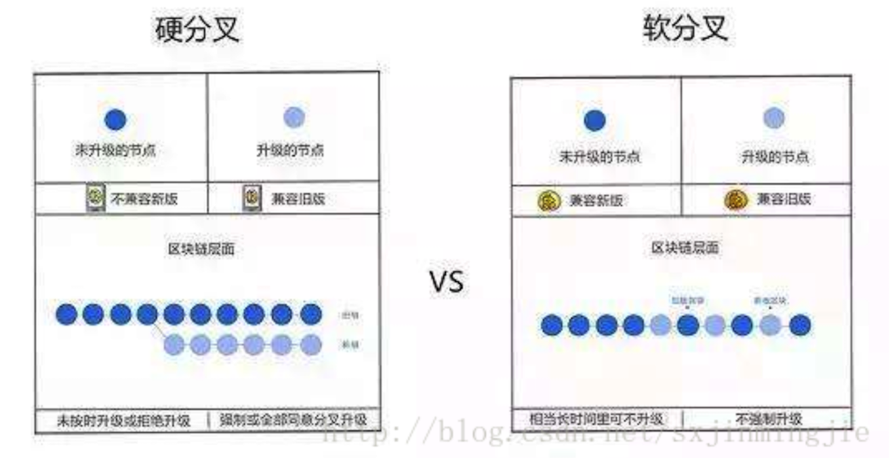

# 解读区块链，软分叉和硬分叉
解读区块链，软分叉和硬分叉
最近在交流群和论坛中经常听到软分叉和硬分叉，起初对这个概念只是简单认为是区块链软件升级后新旧协议造成新旧节点对新的区块认可时的一种分歧，软分叉一般不会产生永久性分叉的链，而硬分叉则会产生两条链，如果大多数节点升级到新版本，则旧链存活就看算力的大小的。
查询了些资料，再次明确下软硬分叉的概念。
软硬分叉涉及的问题是去中心化节点软件、协议、版本升级的问题，所有在区块链中运行的节点有一样的软件，遵守一样的共识机制、维护同一条链，但是一旦软件、协议、版本升级后，所有节点不可能同一时间都更新到同一版本，这就造成了一部分节点拥有新的共识协议机制，这时候会网络中出现新、老、两种节点。那么在区块生成的时候，新节点产生的区块，老节点就会认为合法或者不合法，老节点产生的区块，新节点也会认为合法或者不合法。在区块链中一直有一个51%算力的临界点，那么我们这里认为新节点的算力是大于50%的。

