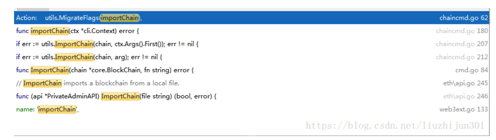
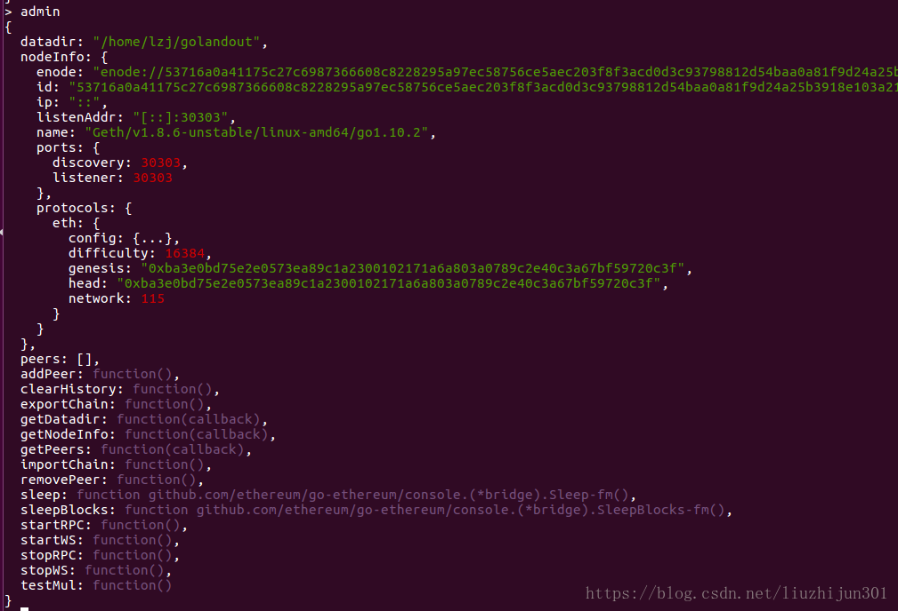
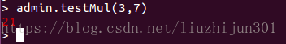

# block problem
## 什么是拜占庭将军问题
```
「拜占庭将军问题」来源于这样一个场景：
拜占庭帝国的军队正在围攻一座城市。这支军队被分成了多支小分队，驻扎在城市周围的不同方位，每支小分队由一个将军领导。
这些将军们彼此之间只能依靠信使传递消息（无法聚在一起开个会）。每个将军在观察自己方位的敌情以后，会给出一个各自的
行动建议（比如进攻、撤退或按兵不动），但最终的需要将军们达成一致的作战计划并共同执行，否则就会被敌人各个击破。
但是，这些将军中可能有叛徒，
他们会尝试阻止其他忠诚的将军达成一致的作战计划。

这就是拜占庭将军的「问题」：只能依靠通信相互交流，又不知道谁是叛徒，怎么能不受叛徒们的影响，让这些忠诚的将军快速的
达到一致的作战计划呢？

很显然，将这一场景套用到计算机系统中也是非常适用的：在一个分布式系统中，针对每个运算，每台独立的机器也需要最终达成
一致的结果。
但每台计算机之间也只能依靠网络通信（显然它们无法聚在一起开会），每台计算机都有出错的可能（被攻击，或故障），从而变
成「叛徒」干扰正常的计算机达成一致。
```
## 以太坊区块与区块头的数据结构解析
```
Block数据结构解析
源代码
// Block represents an entire block in the Ethereum blockchain.

type Block struct {

    header       *Header

    uncles       []*Header

    transactions Transactions

    // caches

    hash atomic.Value

    size atomic.Value

    // Td is used by package core to store the total difficulty

    // of the chain up to and including the block.

    td *big.Int

    // These fields are used by package eth to track

    // inter-peer block relay.

    ReceivedAt   time.Time

    ReceivedFrom interface{}

}

主要属性：
- header：          该区块的信息

- uncles：           该区块所包含的叔块的信息

- transactions：  该区块所包含的交易信息

- td：                   总难度，即从开始区块到本区块（包括本区块）所有的难度的累加

- ReceivedAt：     用于跟踪区块的生成       

- ReceivedFrom：用于跟踪区块的生成

Header数据结构解析
源代码
// Header represents a block header in the Ethereum blockchain.

type Header struct {

   ParentHash  common.Hash    `json:"parentHash" gencodec:"required"`

   UncleHash   common.Hash    `json:"sha3Uncles" gencodec:"required"`

   Coinbase    common.Address `json:"miner" gencodec:"required"`

   Root        common.Hash    `json:"stateRoot" gencodec:"required"`

   TxHash      common.Hash    `json:"transactionsRoot" gencodec:"required"`

   ReceiptHash common.Hash    `json:"receiptsRoot" gencodec:"required"`

   Bloom       Bloom          `json:"logsBloom" gencodec:"required"`

   Difficulty  *big.Int       `json:"difficulty" gencodec:"required"`

   Number      *big.Int       `json:"number" gencodec:"required"`

   GasLimit    uint64         `json:"gasLimit" gencodec:"required"`

   GasUsed     uint64         `json:"gasUsed" gencodec:"required"`

   Time        *big.Int       `json:"timestamp" gencodec:"required"`

   Extra       []byte `json:"extraData" gencodec:"required"`

   Extra2      []byte `json:"extraData2" gencodec:"required"`

   MixDigest   common.Hash    `json:"mixHash" gencodec:"required"`

   Nonce       BlockNonce     `json:"nonce" gencodec:"required"`

}

主要属性：
- ParentHash：  该区块的父区块的哈希值

- UncleHash：   该区块所包含的叔块的哈希值

- Coinbase：     打包该区块矿工的地址，矿工费和打包区块的奖金将发送到这个地址

- Root：             存储账户状态的Merkle树的根节点的哈希

- TxHash：        存储该区块中的交易的Merkle树的根节点的哈希

- ReceiptHash：存储该区块的交易的回单的Merkle树的根节点的哈希

- Bloom：          交易日志的布隆过滤器，用于查询

- Difficulty：       该区块的难度

- Number：       区块号，也是区块高度，也是所有祖先区块的数量

- GasLimit：      该区块的汽油（gas）上限

- GasUsed：     该区块使用的汽油（gas）

- Time：            区块开始打包时间戳（调用Engine.Prepare函数的时候设置）

- MixDigest：    该哈希值与Nonce值一起证明该区块上已经进行了足够的计算，用于证明挖矿成功

- Nonce：         该哈希值与MixDigest哈希值一起证明该区块上已经进行了足够的计算，用于证明挖矿成功

- Extra：           预留它用（例如Clique共识机制使用）

```
## 以太坊的RPC机制
### 1 go语言的RPC机制
  RPC（Remote Procedure Call，远程过程调用）是一种通过网络从远程计算机程序上请求服
务，而不需要了解底层网络细节的应用程序通信协议。RPC协议构建于TCP或UDP，或者是 HTTP
之上，允许开发者直接调用另一台计算机上的程序，而开发者无需额外地为这个调用过程编写网

络通信相关代码，使得开发包括网络分布式程序在内的应用程序更加容易。

    go语言有net/rpc包，net/rpc包允许 RPC 客户端程序通过网络或是其他 I/O 连接调用一个远端对象的公开方法
（必须是大写字母开头、可外部调用的）。在 RPC 服务端，可将一个对象注册为可访问的服务，
之后该对象的公开方法就能够以远程的方式提供访问。一个 RPC 服务端可以注册多个不同类型
的对象，但不允许注册同一类型的多个对象。

    一个对象中只有满足如下这些条件的方法，才能被 RPC 服务端设置为可供远程访问：

必须是在对象外部可公开调用的方法（首字母大写）；
必须有两个参数，且参数的类型都必须是包外部可以访问的类型或者是Go内建支持的类型；
第二个参数必须是一个指针；
方法必须返回一个error类型的值。
以上4个条件，可以简单地用如下一行代码表示：
func (t *T) MethodName(argType T1, replyType *T2) error
接下来，我们来看一组 RPC 服务端和客户端交互的示例程序。

服务端：
```
package main;
 
import (
    "net/rpc"
    "net/http"
    "log"
)
 
//go对RPC的支持，支持三个级别：TCP、HTTP、JSONRPC
//go的RPC只支持GO开发的服务器与客户端之间的交互，因为采用了gob编码
 
//注意字段必须是导出
type Params struct {
    Width, Height int;
}
 
type Rect struct{}
 
//函数必须是导出的
//必须有两个导出类型参数
//第一个参数是接收参数
//第二个参数是返回给客户端参数，必须是指针类型
//函数还要有一个返回值error
func (r *Rect) Area(p Params, ret *int) error {
    *ret = p.Width * p.Height;
    return nil;
}
 
func (r *Rect) Perimeter(p Params, ret *int) error {
    *ret = (p.Width + p.Height) * 2;
    return nil;
}
 
func main() {
    rect := new(Rect);
    //注册一个rect服务
    rpc.Register(rect);
    //把服务处理绑定到http协议上
    rpc.HandleHTTP();
    err := http.ListenAndServe(":8080", nil);
    if err != nil {
        log.Fatal(err);
    }

}
```
客户端：
```
package main;
 
import (
    "net/rpc"
    "log"
    "fmt"
)
 
type Params struct {
    Width, Height int;
}
 
func main() {
    //连接远程rpc服务
    rpc, err := rpc.DialHTTP("tcp", "127.0.0.1:8080");
    if err != nil {
        log.Fatal(err);
    }
    ret := 0;
    //调用远程方法
    //注意第三个参数是指针类型
    err2 := rpc.Call("Rect.Area", Params{50, 100}, &ret);
    if err2 != nil {
        log.Fatal(err2);
    }
    fmt.Println(ret);
    err3 := rpc.Call("Rect.Perimeter", Params{50, 100}, &ret);
    if err3 != nil {
        log.Fatal(err3);
    }
    fmt.Println(ret);
}
```
### 2 以太坊RPC机制

以太坊启动RPC服务

以太坊客户端可以用下面方式来启动RPC监听：
```
geth --rpc --rpcaddr 0.0.0.0 --rpcapi db,eth,net,web3,personal --rpcport 8550
```
这句明命令启动了Http-RPC服务，rpc监听地址是任意ip地址，rcp使用的api接口包括db,eth,net,web,personal等，rpc端口是8550。
#### 以太坊源码中RPC服务启动流程
在以太坊geth的main函数里，有函数
```
func geth(ctx *cli.Context) error {
	node := makeFullNode(ctx)
	startNode(ctx, node)
	node.Wait()
	return nil
}
```
这是geth的主执行函数，通过startNode()启动geth节点，startNode继续调用node/node.go中的Start()函数中，Start()函数中调用了startRPC()函数：
```
// startRPC is a helper method to start all the various RPC endpoint during node
// startup. It's not meant to be called at any time afterwards as it makes certain
// assumptions about the state of the node.
func (n *Node) startRPC(services map[reflect.Type]Service) error {
	// Gather all the possible APIs to surface
	apis := n.apis()
	for _, service := range services {
		apis = append(apis, service.APIs()...)
	}
	// Start the various API endpoints, terminating all in case of errors
	if err := n.startInProc(apis); err != nil {
		return err
	}
	if err := n.startIPC(apis); err != nil {
		n.stopInProc()
		return err
	}
	if err := n.startHTTP(n.httpEndpoint, apis, n.config.HTTPModules, n.config.HTTPCors, n.config.HTTPVirtualHosts); err != nil {
		n.stopIPC()
		n.stopInProc()
		return err
	}
	if err := n.startWS(n.wsEndpoint, apis, n.config.WSModules, n.config.WSOrigins, n.config.WSExposeAll); err != nil {
		n.stopHTTP()
		n.stopIPC()
		n.stopInProc()
		return err
	}
	// All API endpoints started successfully
	n.rpcAPIs = apis
	return nil
}
```
startRPC()收集了node中和services中所有的rpc.API类型的RPC接口，并启动了各种RPC服务形式，包括IPC、HTTP、WS、PROC等各种形式。下面分析启动Http方式的RPC函数startHTTP()：
```
func (n *Node) startHTTP(endpoint string, apis []rpc.API, modules []string, cors []string, vhosts []string) error {
	// Short circuit if the HTTP endpoint isn't being exposed
	if endpoint == "" {
		return nil
	}
	// Generate the whitelist based on the allowed modules
	whitelist := make(map[string]bool)
	for _, module := range modules {
		whitelist[module] = true
	}
	// Register all the APIs exposed by the services
	handler := rpc.NewServer()
	for _, api := range apis {
		if whitelist[api.Namespace] || (len(whitelist) == 0 && api.Public) {
			if err := handler.RegisterName(api.Namespace, api.Service); err != nil {
				return err
			}
			n.log.Debug("HTTP registered", "service", api.Service, "namespace", api.Namespace)
		}
	}
	// All APIs registered, start the HTTP listener
	var (
		listener net.Listener
		err      error
	)
	if listener, err = net.Listen("tcp", endpoint); err != nil {
		return err
	}
	go rpc.NewHTTPServer(cors, vhosts, handler).Serve(listener)
	n.log.Info("HTTP endpoint opened", "url", fmt.Sprintf("http://%s", endpoint), "cors", strings.Join(cors, ","), "vhosts", strings.Join(vhosts, ","))
	// All listeners booted successfully
	n.httpEndpoint = endpoint
	n.httpListener = listener
	n.httpHandler = handler
 
	return nil

}
```
可以看到以太坊中通过Http方式启动RPC服务的流程跟go中的rpc包启动方式基本一致。先是通过rpc.newServer()创建了Server,然后再通过registerName()注册API服务，然后启动Http监听。不过以太坊中的RPC接口API并不是按照标准RPC接口写的，它的基本形式是：
```
func (s *CalcService) Add(a, b int) (int, error)
```
符合以下标准的方法可用于远程访问：

* 对象必须导出
* 方法必须导出
* 方法返回0，1（响应或错误）或2（响应和错误）值
* 方法参数必须导出或是内置类型
* 方法返回值必须导出或是内置类型
#### 客户端调用RPC服务
rpc/client.go中拨号函数：
```
/ The client reconnects automatically if the connection is lost.
func Dial(rawurl string) (*Client, error) {
	return DialContext(context.Background(), rawurl)
}


// DialContext creates a new RPC client, just like Dial.
//
// The context is used to cancel or time out the initial connection establishment. It does
// not affect subsequent interactions with the client.
func DialContext(ctx context.Context, rawurl string) (*Client, error) {
   u, err := url.Parse(rawurl)
   if err != nil {
      return nil, err
   }
   switch u.Scheme {
   case "http", "https":
      return DialHTTP(rawurl)
   case "ws", "wss":
      return DialWebsocket(ctx, rawurl, "")
   case "":
      return DialIPC(ctx, rawurl)
   default:
      return nil, fmt.Errorf("no known transport for URL scheme %q", u.Scheme)
   }

}
```
调用RPC服务的函数：
```
// Call performs a JSON-RPC call with the given arguments and unmarshals into
// result if no error occurred.
//
// The result must be a pointer so that package json can unmarshal into it. You
// can also pass nil, in which case the result is ignored.
func (c *Client) Call(result interface{}, method string, args ...interface{}) error {
	ctx := context.Background()
	return c.CallContext(ctx, result, method, args...)
}
// CallContext performs a JSON-RPC call with the given arguments. If the context is
// canceled before the call has successfully returned, CallContext returns immediately.
//
// The result must be a pointer so that package json can unmarshal into it. You
// can also pass nil, in which case the result is ignored.
func (c *Client) CallContext(ctx context.Context, result interface{}, method string, args ...interface{}) error {
   msg, err := c.newMessage(method, args...)
   if err != nil {
      return err
   }
   op := &requestOp{ids: []json.RawMessage{msg.ID}, resp: make(chan *jsonrpcMessage, 1)}
 
   if c.isHTTP {
      err = c.sendHTTP(ctx, op, msg)
   } else {
      err = c.send(ctx, op, msg)
   }
   if err != nil {
      return err
   }
 
   // dispatch has accepted the request and will close the channel it when it quits.
   switch resp, err := op.wait(ctx); {
   case err != nil:
      return err
   case resp.Error != nil:
      return resp.Error
   case len(resp.Result) == 0:
      return ErrNoResult
   default:
      return json.Unmarshal(resp.Result, &result)
   }

}
```
### 3 web3.js与控制台调用RPC接口
internal/jsre/deps下有web3.js文件，以及internal/web3ext下的web3ext.go文件，封装了可以在console控制台下访问RPC接口的方法和接口。console下面有admin.importChain方法，搜索importChain,可以看到搜索结果，

importChain对应的一个出现在web3ext.go中，
```
new web3._extend.Method({
    name: 'importChain',
    call: 'admin_importChain',
    params: 1
}),
```
函数定义在eth/api.go中：
```
// ImportChain imports a blockchain from a local file.
func (api *PrivateAdminAPI) ImportChain(file string) (bool, error) {
	// Make sure the can access the file to import
	in, err := os.Open(file)
	if err != nil {
		return false, err
	}
	defer in.Close()
     ......
}
```
### 4 自定义RPC接口
依照ImportChain接口的方法，在eth/api.go中定义函数：
```
func (api *PrivateAdminAPI) TestMul(a,b *int) (int, error) {
	return (*a)*(*b),nil;
}
```
然后在web3ext.go中加入声明：
```
new web3._extend.Method({
	name: 'startRPC',
	call: 'admin_startRPC',
	params: 4,
	inputFormatter: [null, null, null, null]
}),
new web3._extend.Method({
	name: 'stopRPC',
	call: 'admin_stopRPC'
}),
new web3._extend.Method({
	name: 'startWS',
	call: 'admin_startWS',
	params: 4,
	inputFormatter: [null, null, null, null]
}),
new web3._extend.Method({
	name: 'stopWS',
	call: 'admin_stopWS'
}),
new web3._extend.Method({
	name: 'testMul',
	call: 'admin_testMul',
	params: 2
}),
],
```
重新编译geth，运行，在控制台输入admin:

可以看到出现了testMul接口，调用testMul接口试一下：


