# golang语言特性
一、垃圾回收　

　　1、内存自动回收。

　　2、只需要创建，不需要释放

 

二、天然并发：

　　1、语言层支持并发，对比python，少了GIL锁。

　　2、goroute，轻量级线程。

　　3、基于CSP模型实现

 

三、channel管道

　　1、管道，类似unix/linux中的pipe

　　2、多个goroute之间通过channel进行通信

　　3、支持任何类型

## Golang的GC算法
虽然Golang的GC自打一开始，就被人所诟病，但是经过这么多年的发展，Golang的GC已经改善了非常多，变得非常优秀了。

以下是Golang GC算法的里程碑：

* v1.1 STW

* v1.3 Mark STW, Sweep 并行

* v1.5 三色标记法

* v1.8 hybrid write barrier

经典的GC算法有三种： 引用计数(reference counting)、 标记-清扫(mark&sweep)、 复制收集(CopyandCollection)。  
Golang的GC算法主要是基于 标记-清扫(markandsweep)算法，并在此基础上做了改进。因此，在此主要介绍一下标记-清扫(mark and sweep)算法，关于引用计数(reference counting)和复制收集(copy and collection)可自行百度。
### 标记-清扫(Mark And Sweep)算法
此算法主要有两个主要的步骤：

* 标记(Mark phase)

* 清除(Sweep phase)

第一步，找出不可达的对象，然后做上标记。
第二步，回收标记好的对象。

操作非常简单，但是有一点需要额外注意：mark and sweep算法在执行的时候，需要程序暂停！即 stop the world。
也就是说，这段时间程序会卡在哪儿。故中文翻译成 卡顿。

我们来看一下图解：

开始标记，程序暂停。程序和对象的此时关系是这样的：
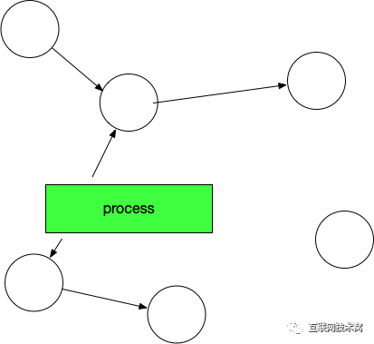
然后开始标记，process找出它所有可达的对象，并做上标记。如下图所示：
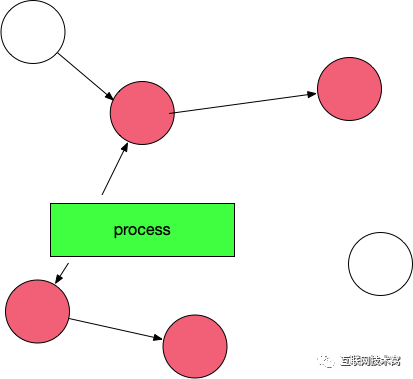
标记完了之后，然后开始清除未标记的对象：

然后垃圾清除了，变成了下图这样。
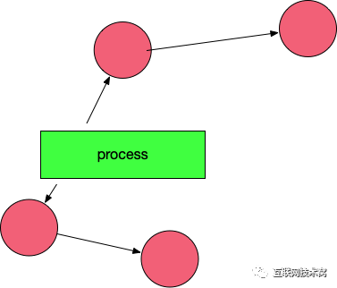
最后，停止暂停，让程序继续跑。然后循环重复这个过程，直到process生命周期结束。
### 标记-清扫(Mark And Sweep)算法存在什么问题？

标记-清扫(Mark And Sweep)算法这种算法虽然非常的简单，但是还存在一些问题：

* STW，stop the world；让程序暂停，程序出现卡顿。

* 标记需要扫描整个heap

* 清除数据会产生heap碎片

这里面最重要的问题就是：mark-and-sweep 算法会暂停整个程序。

Go是如何面对并这个问题的呢？
### 三色并发标记法
我们先来看看Golang的三色标记法的大体流程。

首先：程序创建的对象都标记为白色。
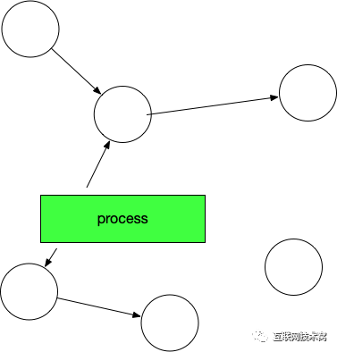
gc开始：扫描所有可到达的对象，标记为灰色
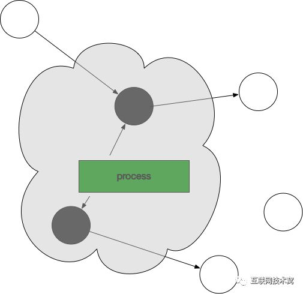
从灰色对象中找到其引用对象标记为灰色，把灰色对象本身标记为黑色
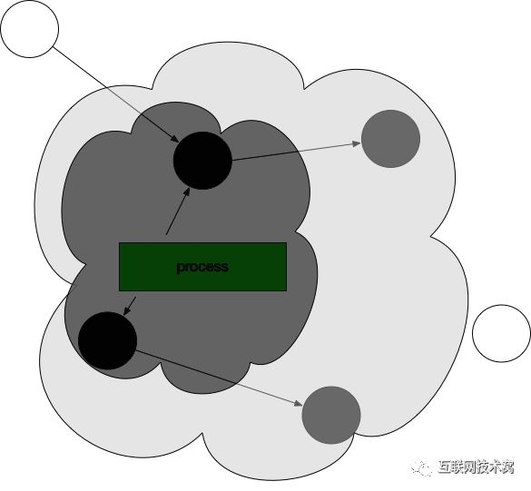
监视对象中的内存修改，并持续上一步的操作，直到灰色标记的对象不存在
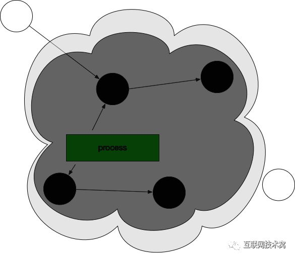
此时，gc回收白色对象。
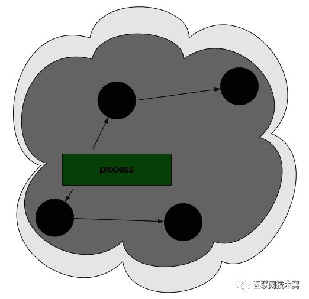
最后，将所有黑色对象变为白色，并重复以上所有过程。
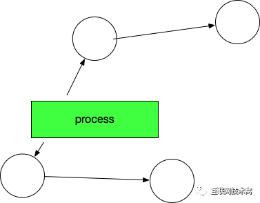
好了，大体的流程就是这样的，让我们回到刚才的问题：Go是如何解决标记-清除(mark and sweep)算法中的卡顿(stw，stop the world)问题的呢？
### gc和用户逻辑如何并行操作？
标记-清除(mark and sweep)算法的STW(stop the world)操作，就是runtime把所有的线程全部冻结掉，所有的线程全部冻结意味着用户逻辑是暂停的。这样所有的对象都不会被修改了，这时候去扫描是绝对安全的。

Go如何减短这个过程呢？标记-清除(mark and sweep)算法包含两部分逻辑：标记和清除。
我们知道Golang三色标记法中最后只剩下的黑白两种对象，黑色对象是程序恢复后接着使用的对象，如果不碰触黑色对象，只清除白色的对象，肯定不会影响程序逻辑。所以： 清除操作和用户逻辑可以并发。

标记操作和用户逻辑也是并发的，用户逻辑会时常生成对象或者改变对象的引用，那么标记和用户逻辑如何并发呢？
### process新生成对象的时候，GC该如何操作呢？不会乱吗？
我们看如下图，在此状态下：process程序又新生成了一个对象，我们设想会变成这样：
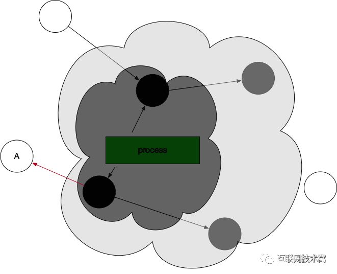
Golang为了解决这个问题，引入了 写屏障这个机制。
写屏障：该屏障之前的写操作和之后的写操作相比，先被系统其它组件感知。
通俗的讲：就是在gc跑的过程中，可以监控对象的内存修改，并对对象进行重新标记。(实际上也是超短暂的stw，然后对对象进行标记)

在上述情况中， 新生成的对象，一律都标位灰色！即下图：
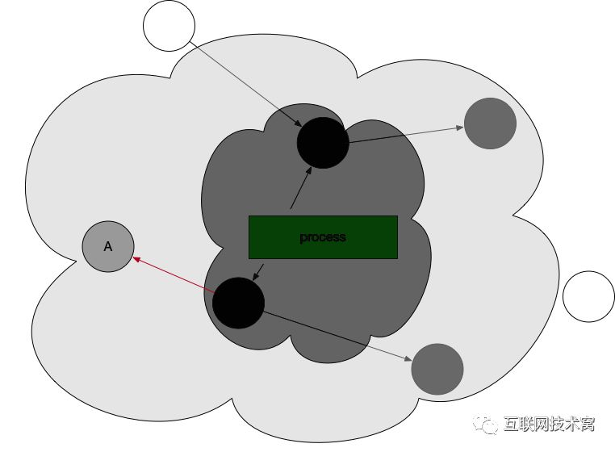
那么，灰色或者黑色对象的引用改为白色对象的时候，Golang是该如何操作的？
看如下图，一个黑色对象引用了曾经标记的白色对象。
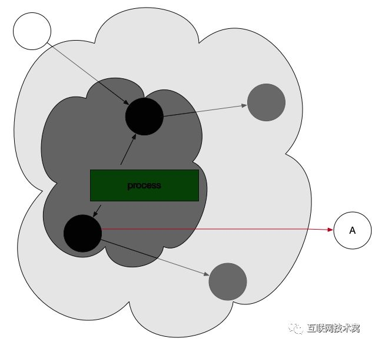
这时候，写屏障机制被触发，向GC发送信号，GC重新扫描对象并标位灰色
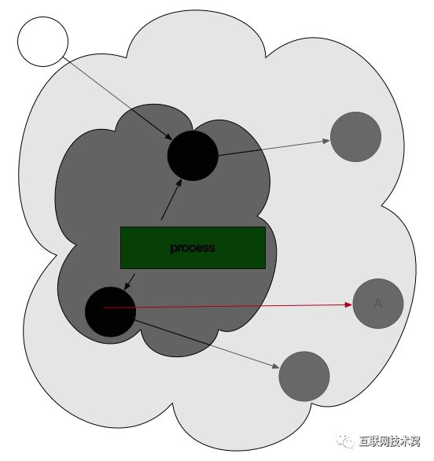
因此，gc一旦开始，无论是创建对象还是对象的引用改变，都会先变为灰色。