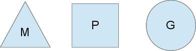

# goroutine
## 一、goroutine简介
```
goroutine的本质是协程，是实现并行计算的核心。goroutine使用方式非常的简单，只需使用go关键字即可启动一个协程，并且它是处于异步方式运行，你不需要等它运行完成以后在执行以后的代码。
```
## 二、goroutine内部原理
* 并发  
  一个cpu上能同时执行多项任务，在很短时间内，cpu来回切换任务执行(在某段很短时间内执行程序a，然后又迅速得切换到程序b去执行)，有时间上的重叠（宏观上是同时的，微观仍是顺序执行）,这样看起来多个任务像是同时执行，这就是并发。
* 并行  
  当系统有多个CPU时,每个CPU同一时刻都运行任务，互不抢占自己所在的CPU资源，同时进行，称为并行。
* 进程  
  cpu在切换程序的时候，如果不保存上一个程序的状态（也就是我们常说的context--上下文），直接切换下一个程序，就会丢失上一个程序的一系列状态，于是引入了进程这个概念，用以划分好程序运行时所需要的资源。因此进程就是一个程序运行时候的所需要的基本资源单位（也可以说是程序运行的一个实体）。
* 线程  
  cpu切换多个进程的时候，会花费不少的时间，因为切换进程需要切换到内核态，而每次调度需要内核态都需要读取用户态的数据，进程一旦多起来，cpu调度会消耗一大堆资源，因此引入了线程的概念，线程本身几乎不占有资源，他们共享进程里的资源，内核调度起来不会那么像进程切换那么耗费资源。
* 协程
  协程拥有自己的寄存器上下文和栈。协程调度切换时，将寄存器上下文和栈保存到其他地方，在切回来的时候，恢复先前保存的寄存器上下文和栈。因此，协程能保留上一次调用时的状态（即所有局部状态的一个特定组合），每次过程重入时，就相当于进入上一次调用的状态，换种说法：进入上一次离开时所处逻辑流的位置。线程和进程的操作是由程序触发系统接口，最后的执行者是系统；协程的操作执行者则是用户自身程序，goroutine也是协程。
  ### 调度模型简介
  groutine能拥有强大的并发实现是通过GPM调度模型实现，下面就来解释下goroutine的调度模型。
  
  
  
  Go的调度器内部有四个重要的结构：M，P，S，Sched，如上图所示（Sched未给出）
  M:M代表内核级线程，一个M就是一个线程，goroutine就是跑在M之上的；M是一个很大的结构，里面维护小对象内存cache（mcache）、当前执行的goroutine、随机数发生器等等非常多的信息
  G:代表一个goroutine，它有自己的栈，instruction pointer和其他信息（正在等待的channel等等），用于调度。
  P:P全称是Processor，处理器，它的主要用途就是用来执行goroutine的，所以它也维护了一个goroutine队列，里面存储了所有需要它来执行的goroutine
  Sched：代表调度器，它维护有存储M和G的队列以及调度器的一些状态信息等。
  
  ### 调度实现
    
    从上图中看，有2个物理线程M，每一个M都拥有一个处理器P，每一个也都有一个正在运行的goroutine。
    P的数量可以通过GOMAXPROCS()来设置，它其实也就代表了真正的并发度，即有多少个goroutine可以同时运行。
    图中灰色的那些goroutine并没有运行，而是出于ready的就绪态，正在等待被调度。P维护着这个队列（称之为runqueue），
    Go语言里，启动一个goroutine很容易：go function 就行，所以每有一个go语句被执行，runqueue队列就在其末尾加入一个
    goroutine，在下一个调度点，就从runqueue中取出（如何决定取哪个goroutine？）一个goroutine执行。
     
    当一个OS线程M0陷入阻塞时（如下图)，P转而在运行M1，图中的M1可能是正被创建，或者从线程缓存中取出。
    
    当MO返回时，它必须尝试取得一个P来运行goroutine，一般情况下，它会从其他的OS线程那里拿一个P过来，
    如果没有拿到的话，它就把goroutine放在一个global runqueue里，然后自己睡眠（放入线程缓存里）。所有的P也会周期性的检查global runqueue并运行其中的goroutine，否则global runqueue上的goroutine永远无法执行。
     
    另一种情况是P所分配的任务G很快就执行完了（分配不均），这就导致了这个处理器P很忙，但是其他的P还有任务，此时如果global runqueue没有任务G了，那么P不得不从其他的P里拿一些G来执行。一般来说，如果P从其他的P那里要拿任务的话，一般就拿run queue的一半，这就确保了每个OS线程都能充分的使用，如下图：
    
## 三、使用goroutine
  ### 基本使用
设置goroutine运行的CPU数量，最新版本的go已经默认已经设置了。
```
num := runtime.NumCPU()    //获取主机的逻辑CPU个数
runtime.GOMAXPROCS(num)    //设置可同时执行的最大CPU数
```   
  ### goroutine异常捕捉
当启动多个goroutine时，如果其中一个goroutine异常了，并且我们并没有对进行异常处理，那么整个程序都会终止，所以我们在编写程序时候最好每个goroutine所运行的函数都做异常处理，异常处理采用recover
  ### 同步的goroutine 
由于goroutine是异步执行的，那很有可能出现主程序退出时还有goroutine没有执行完，此时goroutine也会跟着退出。此时如果想等到所有goroutine任务执行完毕才退出，go提供了sync包和channel来解决同步问题，当然如果你能预测每个goroutine执行的时间，你还可以通过time.Sleep方式等待所有的groutine执行完成以后在退出程序(如上面的列子)。

示例一：使用sync包同步goroutine
sync大致实现方式
WaitGroup 等待一组goroutinue执行完毕. 主程序调用 Add 添加等待的goroutinue数量. 每个goroutinue在执行结束时调用 Done ，此时等待队列数量减1.，主程序通过Wait阻塞，直到等待队列为0.

示例二：通过channel实现goroutine之间的同步。

实现方式：通过channel能在多个groutine之间通讯，当一个goroutine完成时候向channel发送退出信号,等所有goroutine退出时候，利用for循环channe去channel中的信号，若取不到数据会阻塞原理，等待所有goroutine执行完毕，使用该方法有个前提是你已经知道了你启动了多少个goroutine。
  ### goroutine之间的通讯
goroutine本质上是协程，可以理解为不受内核调度，而受go调度器管理的线程。goroutine之间可以通过channel进行通信或者说是数据共享，当然你也可以使用全局变量来进行数据共享。
## 四、channel
  ### 简介  
channel俗称管道，用于数据传递或数据共享，其本质是一个先进先出的队列，使用goroutine+channel进行数据通讯简单高效，同时也线程安全，多个goroutine可同时修改一个channel，不需要加锁。

channel可分为三种类型：

只读channel：只能读channel里面数据，不可写入

只写channel：只能写数据，不可读

一般channel：可读可写

 ###读写数据

需要注意的是：

   * 管道如果未关闭，在读取超时会则会引发deadlock异常
   * 管道如果关闭进行写入数据会pannic
   * 当管道中没有数据时候再行读取或读取到默认值，如int类型默认值是0
```
ch <- "wd"  //写数据
a := <- ch //读取数据
a, ok := <-ch  //优雅的读取数据
```   
 ### 循环管道

需要注意的是：

使用range循环管道，如果管道未关闭会引发deadlock错误。
如果采用for死循环已经关闭的管道，当管道没有数据时候，读取的数据会是管道的默认值，并且循环不会退出。
```
package main

import (
    "fmt"
    "time"
)


func main() {
    mychannel := make(chan int,10)
    for i := 0;i < 10;i++{
        mychannel <- i
    }
    close(mychannel)  //关闭管道
    fmt.Println("data lenght: ",len(mychannel))
    for  v := range mychannel {  //循环管道
        fmt.Println(v)
    }
    fmt.Printf("data lenght:  %d",len(mychannel))
}
```
  ### 带缓冲区channe和不带缓冲区channel
带缓冲区channel：定义声明时候制定了缓冲区大小(长度)，可以保存多个数据。

不带缓冲区channel：只能存一个数据，并且只有当该数据被取出时候才能存下一个数据。
```
ch := make(chan int) //不带缓冲区
ch := make(chan int ,10) //带缓冲区
```
不带缓冲区示例：
```
package main

import "fmt"

func test(c chan int) {
    for i := 0; i < 10; i++ {
        fmt.Println("send ", i)
        c <- i
    }
}
func main() {
    ch := make(chan int)
    go test(ch)
    for j := 0; j < 10; j++ {
        fmt.Println("get ", <-ch)
    }
}


//结果：
send  0
send  1
get  0
get  1
send  2
send  3
get  2
get  3
send  4
send  5
get  4
get  5
send  6
send  7
get  6
get  7
send  8
send  9
get  8
get  9
```
  ### channel实现作业池
我们创建三个channel，一个channel用于接受任务，一个channel用于保持结果，还有个channel用于决定程序退出的时候。
```
package main

import (
    "fmt"
)

func Task(taskch, resch chan int, exitch chan bool) {
    defer func() {   //异常处理
        err := recover()
        if err != nil {
            fmt.Println("do task error：", err)
            return
        }
    }()

    for t := range taskch { //  处理任务
        fmt.Println("do task :", t)
        resch <- t //
    }
    exitch <- true //处理完发送退出信号
}

func main() {
    taskch := make(chan int, 20) //任务管道
    resch := make(chan int, 20)  //结果管道
    exitch := make(chan bool, 5) //退出管道
    go func() {
        for i := 0; i < 10; i++ {
            taskch <- i
        }
        close(taskch)
    }()


    for i := 0; i < 5; i++ {  //启动5个goroutine做任务
        go Task(taskch, resch, exitch)
    }

    go func() { //等5个goroutine结束
        for i := 0; i < 5; i++ {
            <-exitch
        }
        close(resch)  //任务处理完成关闭结果管道，不然range报错
        close(exitch)  //关闭退出管道
    }()

    for res := range resch{  //打印结果
        fmt.Println("task res：",res)
    }
}
```
 ### 只读channel和只写channel
一般定义只读和只写的管道意义不大，更多时候我们可以在参数传递时候指明管道可读还是可写，即使当前管道是可读写的。
```
package main

import (
    "fmt"
    "time"
)

//只能向chan里写数据
func send(c chan<- int) {
    for i := 0; i < 10; i++ {
        c <- i
    }
}
//只能取channel中的数据
func get(c <-chan int) {
    for i := range c {
        fmt.Println(i)
    }
}
func main() {
    c := make(chan int)
    go send(c)
    go get(c)
    time.Sleep(time.Second*1)
}
//结果
0
1
2
3
4
5
6
7
8
9
```
 ### select-case实现非阻塞channel
原理通过select+case加入一组管道，当满足（这里说的满足意思是有数据可读或者可写)select中的某个case时候，那么该case返回，若都不满足case，则走default分支。
```
package main

import (
    "fmt"
)

func send(c chan int)  {
    for i :=1 ; i<10 ;i++  {
     c <-i
     fmt.Println("send data : ",i)
    }
}

func main() {
    resch := make(chan int,20)
    strch := make(chan string,10)
    go send(resch)
    strch <- "wd"
    select {
    case a := <-resch:
        fmt.Println("get data : ", a)
    case b := <-strch:
        fmt.Println("get data : ", b)
    default:
        fmt.Println("no channel actvie")

    }

}

//结果：get data :  wd
```    
  ### channel频率控制
在对channel进行读写的时，go还提供了非常人性化的操作，那就是对读写的频率控制，通过time.Ticke实现

示例：
```
package main

import (
    "time"
    "fmt"
)

func main(){
    requests:= make(chan int ,5)
    for i:=1;i<5;i++{
        requests<-i
    }
    close(requests)
    limiter := time.Tick(time.Second*1)
    for req:=range requests{
        <-limiter
        fmt.Println("requets",req,time.Now()) //执行到这里，需要隔1秒才继续往下执行，time.Tick(timer)上面已定义
    }
}
//结果：
requets 1 2018-07-06 10:17:35.98056403 +0800 CST m=+1.004248763
requets 2 2018-07-06 10:17:36.978123472 +0800 CST m=+2.001798205
requets 3 2018-07-06 10:17:37.980869517 +0800 CST m=+3.004544250
requets 4 2018-07-06 10:17:38.976868836 +0800 CST m=+4.000533569
```
