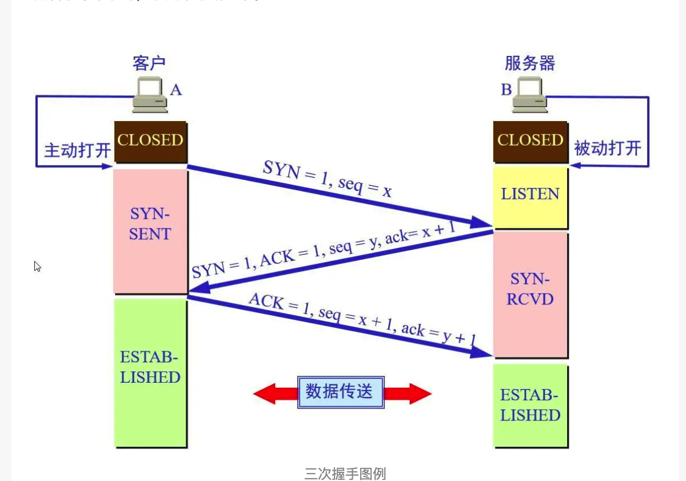
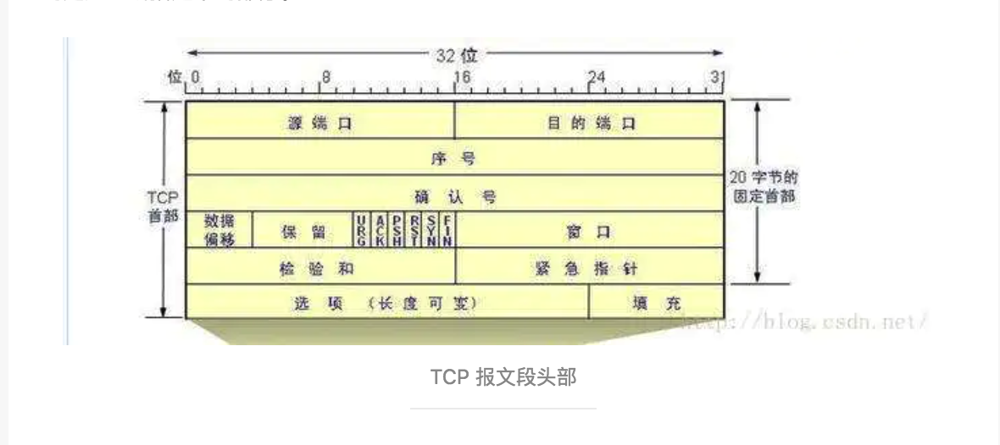
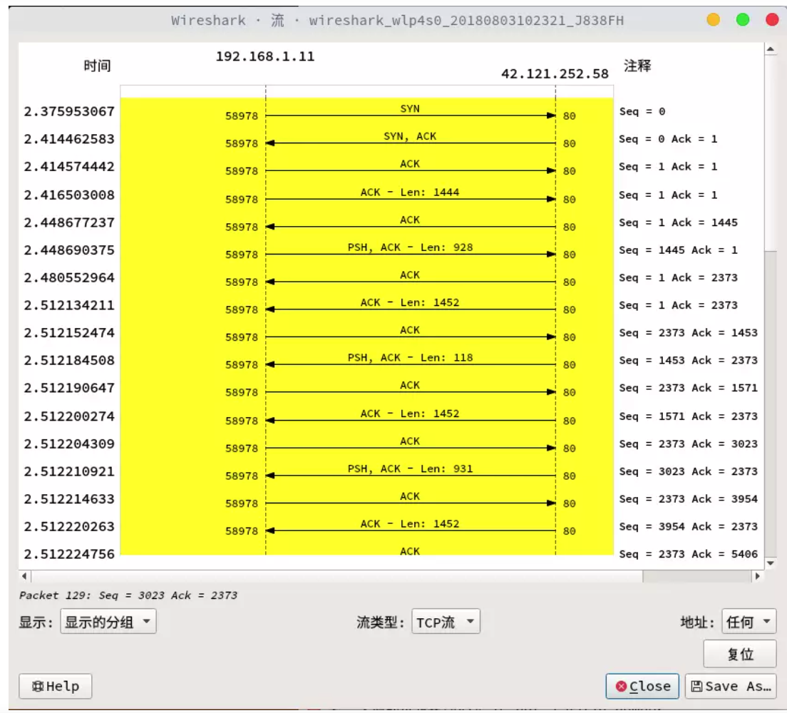

# Http Tcp

## HTTP协议客户端和服务器交互的三次握手、持续连接、断开连接过程

### 建立连接：三次握手

### 连接状态
* CLOSED：表示初始状态。
* LISTEN: 服务器端的某个SOCKET处于监听状态，可以接受连接了。
* SYN_SENT：表示客户端已发送 SYN 报文。
* SYN_RCVD：表示服务器接受到了 SYN 报文。
* ESTABLISHED：表示连接已经建立。

### HTTP 的三次握手使用的是 TCP 协议，所以先看一下 TCP 的报文段首部，三次握手需要注意到的是用红线括起来的部分。

### 字段介绍
* ACK 确认字段：在连接建立后所有传送的报文段 ACK 必须为 1 。
* SYN 同步字段：连接建立时使用同步序号。
* FIN 终止字段：FIN = 1 是表示释放一个连接。
* 序号 seq ：发送了多少被成功接受数据。
* 确认号 ack：接受了多少数据。
### 注意点
* ACK = 1 不携带数据不消耗序号。
* SYN = 1 不能携带数据并且要消耗一个序号。
### 抓包示例

### 示例分析
192.168.1.11 为客户端 A，42.121.252.58 为服务器 B。

1.客户端请求连接发送 SYN 产生一个为 x = 0 的序号 seq
2.服务器接受连接，ACK = x + 1 = 1 并产生 y = 0 的序号 seq；发送 SYN ACK seq = 0 ack = 1 到客户端。  
3.客户端发现服务器接受了连接请求返回了 ack，seq = x；同时接受服务器的请求 ack = y + 1 = 1。  
4.因为上个传输，只传输了一个 ACK 没有数据，所以看第四条线 seq = 1，ack = 1。

收获：看 2 这个列表项，发送端的 seq 字段需要接收到服务器段的 ack 才会变化，这个时候 服务器 ack = 客户端 seq 。

所以我才会有下面对 seq 和 ack 的理解。

* 序号 seq ：发送了多少被成功接受数据。
* 确认号 ack：接受了多少数据。
### 面试问题
为什么使用三次握手？
为了防止已失效的连接请求报文段突然又传送到了服务端，因而产生错误 ——谢希仁著《计算机网络》第四版
谢希仁版《计算机网络》中的例子是这样的，“已失效的连接请求报文段”的产生在这样一种情况下：client发出的第一个连接请求报文段并没有丢失，而是在某个网络结点长时间的滞留了，以致延误到连接释放以后的某个时间才到达server。本来这是一个早已失效的报文段。但server收到此失效的连接请求报文段后，就误认为是client再次发出的一个新的连接请求。于是就向client发出确认报文段，同意建立连接。假设不采用“三次握手”，那么只要server发出确认，新的连接就建立了。由于现在client并没有发出建立连接的请求，因此不会理睬server的确认，也不会向server发送数据。但server却以为新的运输连接已经建立，并一直等待client发来数据。这样，server的很多资源就白白浪费掉了。采用“三次握手”的办法可以防止上述现象发生。例如刚才那种情况，client不会向server的确认发出确认。server由于收不到确认，就知道client并没有要求建立连接。”主要目的防止server端一直等待，浪费资源。

观察 SYN 的含义：同部字段。如果客户端和服务器端都需要使用 SYN-ACK 机制同步一下的话，最少是需要 3 次握手的。另一方面服务器资源相对于客户端资源是更加重要一点。

