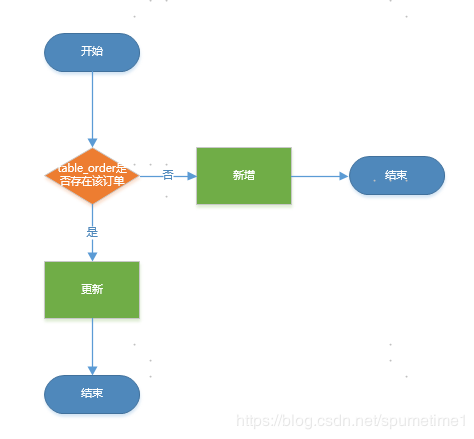
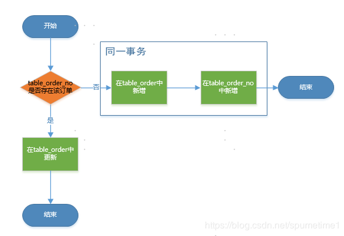
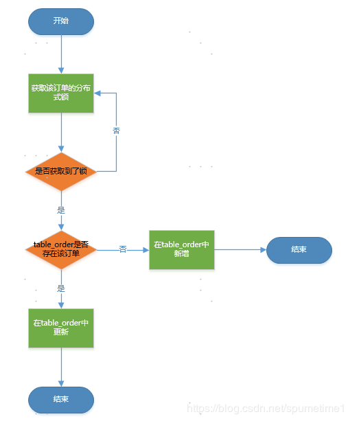
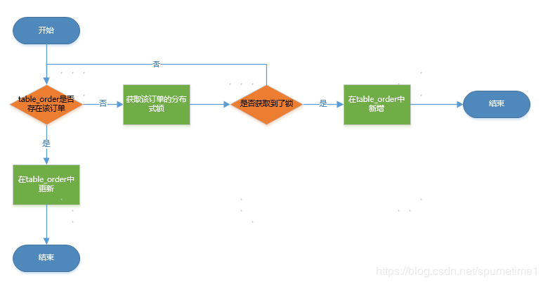

# MySQL 事务
MySQL 事务主要用于处理操作量大，复杂度高的数据。比如说，在人员管理系统中，你删除一个人员，你既需要删除人员的基本资料，也要删除和该人员相关的信息，如信箱，文章等等，这样，这些数据库操作语句就构成一个事务！

* 在 MySQL 中只有使用了 Innodb 数据库引擎的数据库或表才支持事务。
* 事务处理可以用来维护数据库的完整性，保证成批的 SQL 语句要么全部执行，要么全部不执行。
* 事务用来管理 insert,update,delete 语句

一般来说，事务是必须满足4个条件（ACID）：：原子性（Atomicity，或称不可分割性）、一致性（Consistency）、隔离性（Isolation，又称独立性）、持久性（Durability）。

* 原子性：一个事务（transaction）中的所有操作，要么全部完成，要么全部不完成，不会结束在中间某个环节。事务在执行过程中发生错误，会被回滚（Rollback）到事务开始前的状态，就像这个事务从来没有执行过一样。

* 一致性：在事务开始之前和事务结束以后，数据库的完整性没有被破坏。这表示写入的资料必须完全符合所有的预设规则，这包含资料的精确度、串联性以及后续数据库可以自发性地完成预定的工作。

* 隔离性：数据库允许多个并发事务同时对其数据进行读写和修改的能力，隔离性可以防止多个事务并发执行时由于交叉执行而导致数据的不一致。事务隔离分为不同级别，包括读未提交（Read uncommitted）、读提交（read committed）、可重复读（repeatable read）和串行化（Serializable）。

* 持久性：事务处理结束后，对数据的修改就是永久的，即便系统故障也不会丢失。


事务执行前后，数据的总量一致
## 面试题
#### 1.Mysql中InnoDB支持的四种事务隔离级别名称，以及逐级之间的区别？
SQL标准定义的四个隔离级别为：

  read uncommited ：读到未提交数据  
  read committed：脏读，不可重复读  
  repeatable read：可重读  
  serializable ：串行事物  
#### 2.MYSQL支持事务吗？
在缺省模式下，MYSQL是autocommit模式的，所有的数据库更新操作都会即时提交，所以在缺省情况下，mysql是不支持事务的。

但是如果你的MYSQL表类型是使用InnoDB Tables 或 BDB tables的话，你的MYSQL就可以使用事务处理,使用SET
AUTOCOMMIT=0就可以使MYSQL允许在非autocommit模式，在非autocommit模式下，你必须使用COMMIT来提交你的更改，或者用ROLLBACK来回滚你的更改。

#### 3.数据库中的事务是什么?
事务（transaction）是作为一个单元的一组有序的数据库操作。如果组中的所有操作都成功，则认为事务成功，即使只有一个操作失败，事务也不成功。如果所有操作完成，事务则提交，其修改将作用于所有其他数据库进程。如果一个操作失败，则事务将回滚，该事务所有操作的影响都将取消。

 

事务特性：

（1）原子性：即不可分割性，事务要么全部被执行，要么就全部不被执行。

（2）一致性或可串性。事务的执行使得数据库从一种正确状态转换成另一种正确状态

（3）隔离性。在事务正确提交之前，不允许把该事务对数据的任何改变提供给任何其他事务，多个事务同时执行，但是互无影响。

（4） 持久性。事务正确提交后，其结果将永久保存在数据库中，即使在事务提交后有了其他故障，事务的处理结果也会得到保存。

或者这样理解：

事务就是被绑定在一起作为一个逻辑工作单元的SQL语句分组，如果任何一个语句操作失败那么整个操作就被失败，以后操作就会回滚到操作前状态，或者是上有个节点。为了确保要么执行，要么不执行，就可以使用事务。要将有组语句作为事务考虑，就需要通过ACID测试，即原子性，一致性，隔离性和持久性。

#### 4.Myql中的事务回滚机制概述
事务是用户定义的一个数据库操作序列，这些操作要么全做要么全不做，是一个不可分割的工作单位，事务回滚是指将该事务已经完成的对数据库的更新操作撤销。

要同时修改数据库中两个不同表时，如果它们不是一个事务的话，当第一个表修改完，可能第二个表修改过程中出现了异常而没能修改，此时就只有第二个表依旧是未修改之前的状态，而第一个表已经被修改完毕。而当你把它们设定为一个事务的时候，当第一个表修改完，第二表修改出现异常而没能修改，第一个表和第二个表都要回到未修改的状态，这就是所谓的事务回滚
##  分布式mysql +  mycat实现数据库分片（分库分表）
### MYSQL分区表如何保证数据唯一性
#### 背景：
由于业务数据量大，采用了分库分表（Mycat）；为了提高查询效率，使用了时间来分区；分区之后表的唯一索引必须带上分区字段。

假设有一张订单表（table_order）业务字段为order_no（订单号），分区字段为create_tm（创建时间）；唯一索引就是联合索引order_no+create_tm。
#### 问题：
分布式系统中多个节点，对同一订单并发处理，发现table_order中没有该订单，然后都在该表中增加订单。因为订单号没有唯一索引，多个节点都新增数据成功，这就导致table_order中出现多条同样的订单数据。

#### 解决方案一：
使用数据库唯一索引保证数据唯一性

建立一张中间表（假设为table_order_no），该表不分区，使用order_no作为唯一索引；同时保证每次在table_order中新增数据时，在table_order_no表中也新增数据。

#### 解决方案二：
使用分布式锁防止并发处理

每次在处理订单时，都去尝试获取分布式锁，只有获取成功才能处理该订单。通过防止并发，保证一次只有一个节点处理订单，可以避免同时插入同一订单，从而保证订单唯一性。

#### 方案二优化：
只在新增时，使用分布式锁，避免每次处理都去获取分布式锁，影响性能。

### mysql实现分布式锁
#### 纯数据库表实现方式
首先创建一张表:
```
CREATE TABLE `methodLock` (
  `id` int(11) NOT NULL AUTO_INCREMENT COMMENT '主键',
  `method_name` varchar(64) NOT NULL DEFAULT '' COMMENT '锁定的方法名',
  `desc` varchar(1024) NOT NULL DEFAULT '备注信息',
  `update_time` timestamp NOT NULL DEFAULT CURRENT_TIMESTAMP ON UPDATE CURRENT_TIMESTAMP COMMENT '保存数据时间，自动生成',
  PRIMARY KEY (`id`),
  UNIQUE KEY `uidx_method_name` (`method_name `) USING BTREE
) ENGINE=InnoDB DEFAULT CHARSET=utf8 COMMENT='锁定中的方法';
```
当我们想要锁住某个方法时，执行以下SQL：
```
insert into methodLock(method_name,desc) values (‘method_name’,‘desc’)
```

因为我们对method_name做了唯一性约束，这里如果有多个请求同时提交到数据库的话，数据库会保证只有一个操作可以成功，那么我们就可以认为操作成功的那个线程获得了该方法的锁，可以执行方法体内容。
当方法执行完毕之后，想要释放锁的话，需要执行以下Sql:
```
delete from methodLock where method_name ='method_name'
```
上面这种简单的实现有以下几个问题：

* 这把锁强依赖数据库的可用性，数据库是一个单点，一旦数据库挂掉，会导致业务系统不可用。
* 这把锁没有失效时间，一旦解锁操作失败，就会导致锁记录一直在数据库中，其他线程无法再获得到锁。
* 这把锁只能是非阻塞的，因为数据的insert操作，一旦插入失败就会直接报错。没有获得锁的线程并不会进入排队队列，要想再次获得锁就要再次触发获得锁操作。
* 这把锁是不可重入的，同一个线程在没有释放锁之前无法再次获得该锁。因为数据中数据已经存在了。
当然，我们也可以有其他方式解决上面的问题。

* 数据库是单点？搞两个数据库，数据之前双向同步。一旦挂掉快速切换到备库上。
* 没有失效时间？只要做一个定时任务，每隔一定时间把数据库中的超时数据清理一遍
* 非阻塞的？搞一个while循环，直到insert成功再返回成功。
非重入的？在数据库表中加个字段，记录当前获得锁的机器的主机信息和线程信息，那么下次再获取锁的时候先查询数据库，如果当前机器的主机信息和线程信息在数据库可以查到的话，直接把锁分配给他就可以了。
### 基于数据库排他锁
除了可以通过增删操作数据表中的记录以外，其实还可以借助数据中自带的锁来实现分布式的锁。

我们还用刚刚创建的那张数据库表。可以通过数据库的排他锁来实现分布式锁。
基于MySql的InnoDB引擎，可以使用以下方法来实现加锁操作:
```
public boolean lock(){
    connection.setAutoCommit(false)
    while(true){
        try{
            result = select * from methodLock where method_name=xxx for update;
            if(result==null){
                return true;
            }
        }catch(Exception e){

        }
        sleep(1000);
    }
    return false;
}
```
在查询语句后面增加for update，数据库会在查询过程中给数据库表增加排他锁。当某条记录被加上排他锁之后，其他线程无法再在该行记录上增加排他锁。（这里再多提一句，InnoDB引擎在加锁的时候，只有通过索引进行检索的时候才会使用行级锁，否则会使用表级锁。这里我们希望使用行级锁，就要给method_name添加索引，值得注意的是，这个索引一定要创建成唯一索引，否则会出现多个重载方法之间无法同时被访问的问题。重载方法的话建议把参数类型也加上）

我们可以认为获得排它锁的线程即可获得分布式锁，当获取到锁之后，可以执行方法的业务逻辑，执行完方法之后，再通过以下方法解锁：
```
public void unlock(){
    connection.commit();
}

```
这里还可能存在另外一个问题，虽然我们对method_name 使用了唯一索引，并且显示使用for update来使用行级锁。但是，MySql会对查询进行优化，即便在条件中使用了索引字段，但是否使用索引来检索数据是由 MySQL 通过判断不同执行计划的代价来决定的，如果 MySQL 认为全表扫效率更高，比如对一些很小的表，它就不会使用索引，这种情况下 InnoDB 将使用表锁，而不是行锁。如果发生这种情况就悲剧了。。。

还有一个问题，就是我们要使用排他锁来进行分布式锁的lock，那么一个排他锁长时间不提交，就会占用数据库连接。一旦类似的连接变得多了，就可能把数据库连接池撑爆。

### go 利用orm简单实现接口分布式锁
在开发中有些敏感接口，例如用户余额提现接口，需要考虑在并发情况下接口是否会发生问题。如果用户将自己的多条提现请求同时发送到服务器，代码能否扛得住呢？一旦没做锁，那么就真的会给用户多次提现，给公司带来损失。我来简单介绍一下在这种接口开发过程中，我的做法。
第一阶段:

我们使用的orm为xorm，提现表对应的结构体如下
```
type Participating struct {
    ID      uint          `xorm:"autoincr id" json:"id,omitempty"`
    Openid  string        `xorm:"openid" json:"openid"`
    Hit     uint          `xorm:"hit" json:"hit"`
    Orderid string        `xorm:"order_id" json:"order_id"`
    Redpack uint          `xorm:"redpack" json:"redpack"`
    Status  uint          `xorm:"status" json:"status"`
    Ctime   tool.JsonTime `xorm:"ctime" json:"ctime,omitempty"`
    Utime   tool.JsonTime `xorm:"utime" json:"utime,omitempty"`
    PayTime tool.JsonTime `xorm:"pay_time" json:"pay_time,omitempty"`
}
```
在Participating表中，是以Openid去重的，当一个Openid对应的Hit为1时，可以按照Redpack的数额提现，成功后将Status改为1，简单来说这就是提现接口的业务逻辑。

起初我并没有太在意并发的问题，我在MySQL的提现表中设置一个字段status来记录提现状态，我只是在提现时将状态修改为2(体现中)，提现完成后将status修改为1(已提现)。然后事实证明，我太天真了，用ab做了测试1s发送了1000个请求到服务器，结果。。。成功提现了6次。部分代码如下
```
p_info := &Participating{}<br>// 查找具体提现数额
has, _ := db.Dalmore.Where("openid = ? and hit = 1 and status = 0", openid).Get(p_info)
if !has {
    resp.Error(errcode.NO_REDPACK_FOUND, nil, nil)
    return
}
 
// 改status为提现中
p_info.Status = 2
db.Dalmore.Cols("status").Where("openid = ? and hit = 1 and status = 0", openid).Update(p_info)
 
// 提现p_info.Redpack
```
#### 第二阶段：

既然出现了并发问题，那第一反应肯定的加锁啊，代码如下：
```
type Set struct {
    m map[string]bool
    sync.RWMutex
}
 
func New() *Set {
    return &Set{
        m: map[string]bool{},
    }
}
 
var nodelock = set.New()
 
// 加锁
nodelock.Lock()
 
p_info := &Participating{}
// 查找具体提现数额
has, _ := db.Dalmore.Where("openid = ? and hit = 1 and status = 0", openid).Get(p_info)
if !has {
    resp.Error(errcode.NO_REDPACK_FOUND, nil, nil)
    return
}
 
// 改status为提现中
p_info.Status = 2
db.Dalmore.Cols("status").Where("openid = ? and hit = 1 and status = 0", openid).Update(p_info)
 
// 释放锁
nodelock.Unlock()
 
// 提现p_info.Redpack
```
加了锁以后。。。emem，允许多次提现的问题解决了，但是这个锁限制的范围太多了，直接让这段加锁代码变成串行，这大大降低了接口性能。而且，一旦部署多个服务端，这个锁又会出现多次提现的问题，因为他只能拦住这一个服务的并发。看来得搞一个不影响性能的分布式才是王道啊。

 

第三阶段：

利用redis，设置一个key为openid的分布式锁，并设置一个过期时间可以解决当前的这个问题。但是难道就没别的办法了吗？当然是有的，golang的xorm中Update函数其实是有返回值的：num,err，我就是利用num做了个分布式锁。
```
//记录update修改条数
num, err := db.Dalmore.Cols("status").Where("openid = ? and status = 0 and hit = 1", openid).Update(p_update)
if err != nil {
    logger.Runtime().Debug(map[string]interface{}{"error": err.Error()}, "error while updating")
    resp.Error(errcode.INTERNAL_ERROR, nil, nil)
    return
}
 
// 查看update操作到底修改了多少条数据，起到了分布式锁的作用
if num != 1 {
    resp.Error(errcode.NO_REDPACK_FOUND, nil, nil)
    return
}
 
p_info := &Participating{}
_, err := db.Dalmore.Where("openid = ? and status = 2", openid).Get(p_info)
if err != nil {
    logger.Runtime().Debug(map[string]interface{}{"error": err.Error()}, "error while selecting")
    resp.Error(errcode.INTERNAL_ERROR, nil, nil)
    return
}
 
// 提现p_info.Redpack
```
其实有点投机取巧的意思，利用xorm的Update函数，我们将核对并发处理请求下数据准确性的问题抛给了MySQL，毕竟MySQL是经过千锤百炼的。再用ab测试，嗯，锁成功了只有，只提现了一次，大功告成～